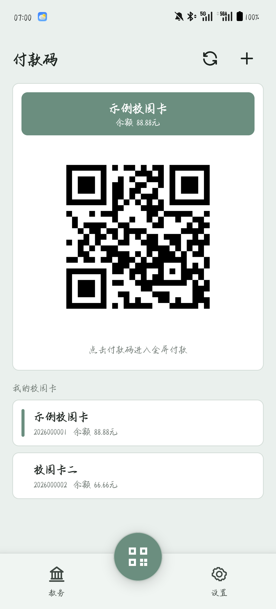
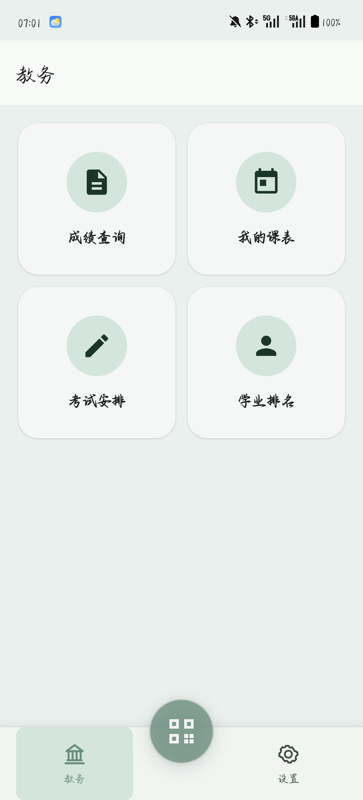
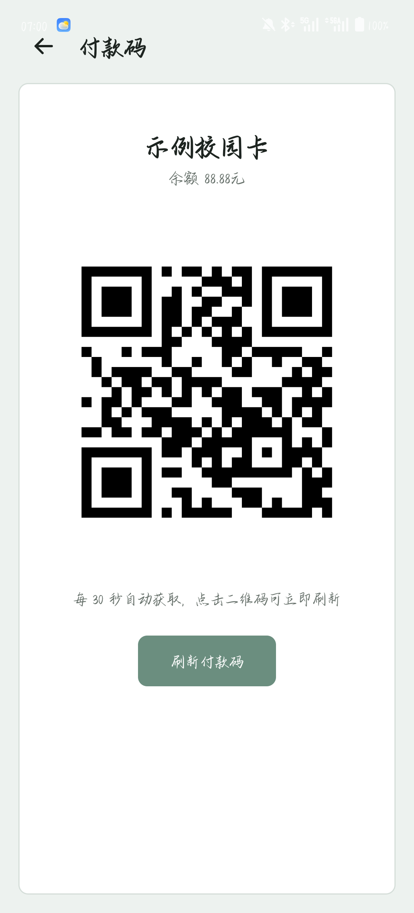
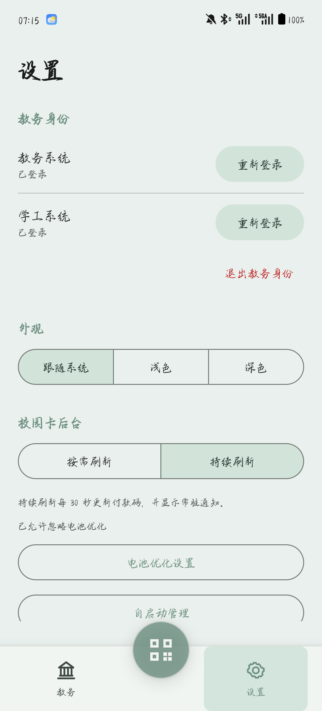
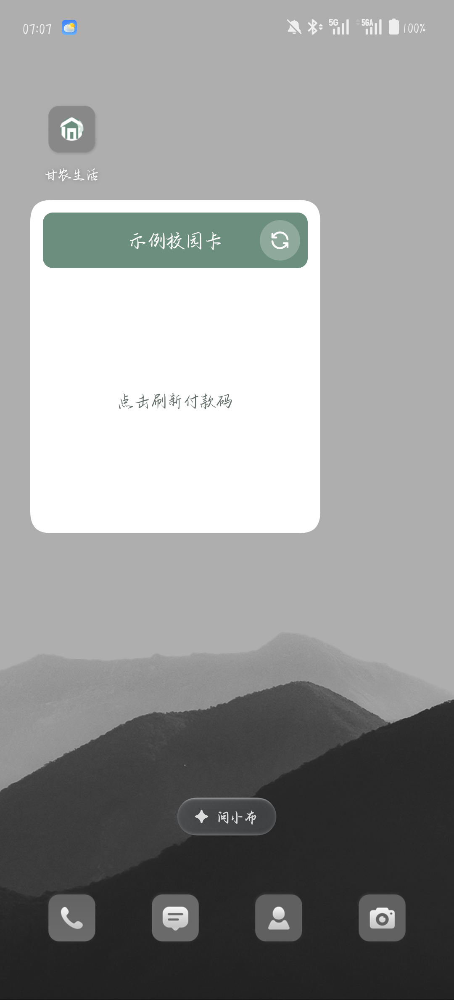

<p align="center">
  
</p>

# 甘农生活

**校园卡付款、教务查询和日常设置，一个应用就够了。**

打开应用就是付款码；左右两个入口分别通往教务与设置，不用再在多个应用和网页之间来回寻找。

> [!IMPORTANT]
> 本软件目前仅支持 Android，最低需要 Android 7.0（API 24）。校园卡、教务系统与学工系统均依赖甘肃农业大学现有服务，学校页面调整或服务维护期间，部分功能可能暂时不可用。

[](https://developer.android.com)
[](https://apilevels.com)
[](https://kotlinlang.org)
[](LICENSE)
[](https://github.com/RE-TikaRa/GSAULife/releases)

---

付款码字符串由校园卡页面获取，二维码在手机本地通过 ZXing 渲染。应用不会向开发者服务上传校园卡链接、学校 Cookie 或教务数据。

<br />

<table>
<tr>
<td width="55%" valign="top">

### 付款码首页

应用默认进入付款码页面，当前校园卡、余额和二维码放在最显眼的位置，多张校园卡排列在下方。

- 点 **校园卡** → 切换当前卡
- 长按 **校园卡** → 修改备注、重新绑定或删除
- 点右上 **＋** → 粘贴付款码链接添加校园卡
- 点 **二维码** → 进入全屏付款页

</td>
<td width="45%" valign="top" align="center">



</td>
</tr>
</table>

<table>
<tr>
<td width="55%" valign="top">

### 教务四宫格

教务入口集中放置常用的四项查询。教务系统负责成绩、课表和考试安排，学工系统负责学业排名。

- **成绩查询** → 学期分组、平均分、绩点、学分和成绩明细
- **我的课表** → 按教学周查看课程，支持开学日期和当前周校准
- **考试安排** → 读取当前学期考试时间、地点和座位
- **学业排名** → 查看专业与班级排名

</td>
<td width="45%" valign="top" align="center">



</td>
</tr>
</table>

<table>
<tr>
<td width="55%" valign="top">

### 全屏付款页

全屏页面自动把亮度调至最高，并保持屏幕常亮。付款码每 30 秒更新一次，超过 60 秒的旧码会从界面清除。

- 打开页面 → 显示当前校园卡与余额
- 点 **二维码** → 立即刷新
- 点 **刷新付款码** → 重新获取最新码
- 离开页面 → 恢复原有亮度与后台刷新方式

</td>
<td width="45%" valign="top" align="center">



</td>
</tr>
</table>

<table>
<tr>
<td width="55%" valign="top">

### 设置页

学校身份、主题、校园卡后台与版本更新集中在设置页。界面使用一套莫兰迪绿色，并支持三种明暗模式。

- **教务系统 / 学工系统** → 分别登录或重新认证
- **跟随系统 / 浅色 / 深色** → 切换应用外观
- **按需刷新 / 持续刷新** → 选择校园卡后台方式
- **电池优化 / 自启动** → 前往系统设置管理后台权限

</td>
<td width="45%" valign="top" align="center">



</td>
</tr>
</table>

<table>
<tr>
<td width="55%" valign="top">

### 桌面组件

桌面组件显示当前校园卡和付款码，不打开应用也能完成切卡、刷新和付款。

- 点 **校园卡名称** → 切换下一张卡
- 点 **二维码** → 打开全屏付款页
- 点右上 **刷新** → 获取最新付款码
- 付款码超过 **60 秒** → 自动清除，避免继续展示旧码

</td>
<td width="45%" valign="top" align="center">



</td>
</tr>
</table>

## 功能

| 功能 | 说明 |
|---|---|
| **付款码首页** | 默认首页显示当前校园卡、余额和二维码，支持多张校园卡切换、备注、重新绑定与删除 |
| **全屏付款** | 自动提升亮度并保持屏幕常亮，每 30 秒更新付款码，支持手动刷新 |
| **桌面组件** | 在桌面切卡、刷新付款码或打开全屏付款页，旧码在 60 秒后清除 |
| **成绩查询** | 按学期展示成绩、平均分、平均绩点、总学分、课程数与分项明细 |
| **我的课表** | 按教学周查看课程，支持设置开学日期或输入当前教学周进行校准 |
| **考试安排** | 展示当前学期的考试课程、时间、地点与座位 |
| **学业排名** | 展示专业排名、专业人数、班级排名与班级人数 |
| **离线教务** | 查询成功后保存成绩、课表、考试、排名及已打开的成绩明细，并标注更新时间 |
| **三种外观** | 跟随系统、浅色、深色，统一使用莫兰迪绿色主题 |
| **两种刷新方式** | 按需刷新适合日常使用，持续刷新通过前台服务每 30 秒更新付款码 |
| **检查更新** | 读取 GitHub Releases，并通过 Cloudflare Worker 打开发布页 |

## 使用

1. 安装 APK 并打开「甘农生活」，阅读并同意隐私政策与服务协议。
2. 在付款码页面点右上角 **＋**，粘贴校园卡付款码页面复制出的链接。
3. 在教务页选择功能，根据提示登录教务系统或学工系统。
4. 长按桌面添加「甘农生活付款码」组件。
5. 需要持续刷新时，在设置页开启持续刷新，并配置电池优化与自启动权限。

校园卡链接与学校身份彼此独立，退出教务身份不会删除已经添加的校园卡。

## 架构

```text
GSAULife
├── app
│   ├── MainActivity       三入口导航与页面生命周期
│   ├── SettingsFragment   学校身份、外观、后台刷新与关于信息
│   ├── AppearanceManager  跟随系统 / 浅色 / 深色
│   └── UpdateChecker      GitHub Releases 版本检查
├── feature-card
│   ├── data               校园卡、链接解析、付款码获取与缓存
│   ├── qr                 ZXing 本地二维码渲染
│   ├── ui                 付款码首页、全屏付款页与校园卡管理
│   ├── widget             桌面付款组件
│   └── work               前台刷新服务、过期清理与系统设置入口
└── feature-academic
    ├── data               学校会话、教务与学工请求、解析和离线缓存
    ├── model              成绩、课程、考试和排名模型
    └── ui                 教务四宫格、列表、课表、登录与成绩明细
```

<details>
<summary><b>校园卡链接是什么</b></summary>

<br />

校园卡付款码页面的链接包含 `openid` 和卡片编号。应用保存链接中的必要字段，随后从甘肃农业大学校园卡页面读取付款码、姓名、卡号和余额；二维码始终在本地生成。

</details>

<details>
<summary><b>教务数据怎么保存</b></summary>

<br />

教务系统与学工系统使用各自的学校会话。查询成功后，数据写入应用私有存储；网络不可用或会话过期时，仍可查看带有更新时间的已有数据。主动退出教务身份会清除两套学校会话、教学周设置和全部教务缓存。

</details>

## 构建

需要 JDK 17 和 Android SDK 37，工程使用 Gradle 9.6.1 与 Android Gradle Plugin 9.2.1。

```bash
./gradlew test lint :app:assembleDebug :app:assembleRelease --console=plain
```

Debug APK 位于 `app/build/outputs/apk/debug/app-debug.apk`。未提供签名环境变量时，Release 构建会生成未签名 APK。

本地构建其他版本时使用：

```bash
VERSION_NAME=1.0.1 ./gradlew :app:assembleRelease
```

## 发布新版本

推送三段式稳定版标签后，[`release.yml`](.github/workflows/release.yml) 会执行测试、Lint、Debug 与签名 Release 构建，验证 APK 证书并创建 GitHub Release。

```bash
git push origin main
git tag v1.0.0
git push origin v1.0.0
gh run list --workflow Release
```

工作流需要以下 GitHub Secrets：

```text
KEYSTORE_BASE64
KEYSTORE_PASSWORD
KEY_ALIAS
KEY_PASSWORD
```

版本码按 `主版本 × 1000000 + 次版本 × 1000 + 修订版本` 生成。标签必须使用 `v主版本.次版本.修订版本` 格式，并高于已有稳定版标签。

## GitHub 代理

`worker/gh-proxy.js` 部署到 Cloudflare Worker `gh-proxy`，并绑定 `gh.re-tikara.fun`：

```bash
wrangler deploy --config worker/wrangler.toml --keep-vars
wrangler secret put GITHUB_TOKEN --config worker/wrangler.toml
```

Worker Token 只需要读取公开 Release 的权限。

## 数据与隐私

- 校园卡链接、学校 Cookie 和教务缓存只保存在应用私有存储中。
- 应用关闭云备份与设备迁移，不会把凭据复制到其他设备。
- 教务与学工请求使用 HTTPS，学校数据请求不会携带 Cookie 跟随重定向。
- 应用不读取 GSAU-Card 或 GSAU-Academic-Hub 的旧数据。

## 法律与政策

| 文档 | 内容 |
|---|---|
| [隐私政策](docs/legal/Privacy-Policy.md) | 数据类别、用途、存储、网络通信和删除方式 |
| [服务协议](docs/legal/Terms-of-Service.md) | 服务性质、使用要求、更新、中断和责任边界 |
| [数据处理说明](docs/legal/Data-Policy.md) | 校园卡、学校会话、离线缓存和更新检查流程 |
| [免责声明](docs/legal/Disclaimer.md) | 非官方属性、学校数据、付款与设备风险 |
| [第三方服务说明](docs/legal/Third-Party.md) | 学校系统、GitHub、Cloudflare 和软件依赖 |
| [开源软件声明](docs/legal/Open-Source.md) | Apache License 2.0 与第三方组件许可证 |
| [安全说明](docs/legal/Security.md) | 本地存储、网络、付款码、签名和漏洞报告 |

## 已知限制

- 桌面组件和持续刷新仍会受到国产 Android 系统的省电与后台限制。
- 学校页面调整、统一认证维护或校园网服务异常时，对应查询可能暂时不可用。
- 教务系统与学工系统维护两套会话，第一次使用相关功能时需要分别完成认证。
- 桌面付款码超过 60 秒后会清除，点组件刷新按钮即可重新获取。

## 许可证

本项目基于 [Apache License 2.0](LICENSE) 开源。

<div align="center">
<sub>甘农生活 · 为兴趣而写的校园小工具</sub>
</div>
